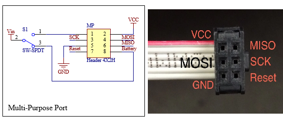
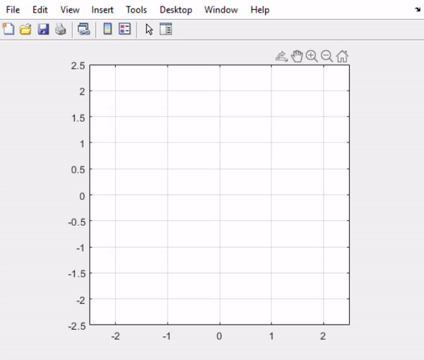
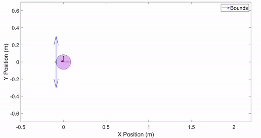

# Delta Rho Robot
3D models, firmware, and MATLAB control scripts for the Delta-Rho swarm robotic platform at WPI's Soft Robotics Laboratory. Contact Cagdas Onal (cdonal@wpi.edu) or Steven Hyland (smhyland@wpi.edu) for more information.

### Hardware:
#### PCB
The robot currently uses a custom PCB housing a ATMega1284p chip. More details along with a schematic can be found in the hardware/controller_board folder. It can be powered via 7.4V LiPo battery, make sure not to flip + and -

#### CAD
Currently, the robot is designed in SolidWorks, with most of the chassis and body 3D printed. Other necessary and optional components can be found in the hardware/CAD folder.

### Firmware:
Flashing firmware to the robot is performed with a standard AVRISP MKII programmer over ISP interface. Connect the programmer to the robot following following the correct wiring:

Use Microchip Studio and open the 'Delta_Rho_controller.atsln' solution file. Code is written in C, and can be flashed to the robot using the 'start debugging' button or pressing 'f5'. Currently, the firmware allows for onboard computation, code execution, etc. but can also be moved offboard to MATLAB (controller code provided in 'control_single_robot' folder). 

NOTE: the ROBOT ID at the top of the robot code is critical for communicating and differentiating between robots when handling a multi-robot swarm. If you are worried about interference between other robots, set these IDs to some unique integer (1 to 255). 

MATLAB Communication is performed through two Xbee RF modules, one 'server' attached to the PC via USB adapter, and one 'client' attached to the header on the robot board.  The demo script should get you started with sending velocity commands to the robot. See the 'utilities' folder for more functions.

#### Communication:
XBee modules need to be flashed to operate on the same bandwidth and to determine the 'server' and 'client' modules, respectively. This setup only needs to be performed once on new XBee modules. 

(FINISH THIS SECTION)

### Simulation:
Currently, all the simulation is performed in MATLAB. Other simulation software is in progress.

---

Reach out to Steven Hyland at smhyland@wpi.edu for further questions or concerns.
