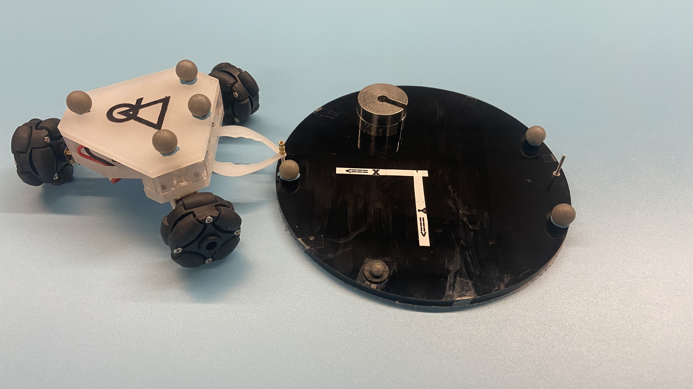

# Delta Rho Robot
3D models, firmware, and MATLAB control scripts for the Delta-Rho swarm robotic platform at WPI's Soft Robotics Laboratory

### General Structure:
The robot currently has a custom PCB housing a ATMega1284p chip. Flashing firmware is done over standard AVRISP programmer using the Microchip Studio software. Firmware is coded in C, and the system is set to operate in a decentralized fashion, however centralized functionality is readily available. Firmware allows for onboard computation, code execution, etc. MATLAB Communication is performed through Xbee RF modules, both between individual robots and between the robots and the computer. A five-bar force sensor has recently been implemented onboard for measuring force magnitude and direction.

### Simulation:
Currently, all the simulation is performed in MATLAB. 

---

Reach out to Steven Hyland at smhyland@wpi.edu for further questions or concerns.
